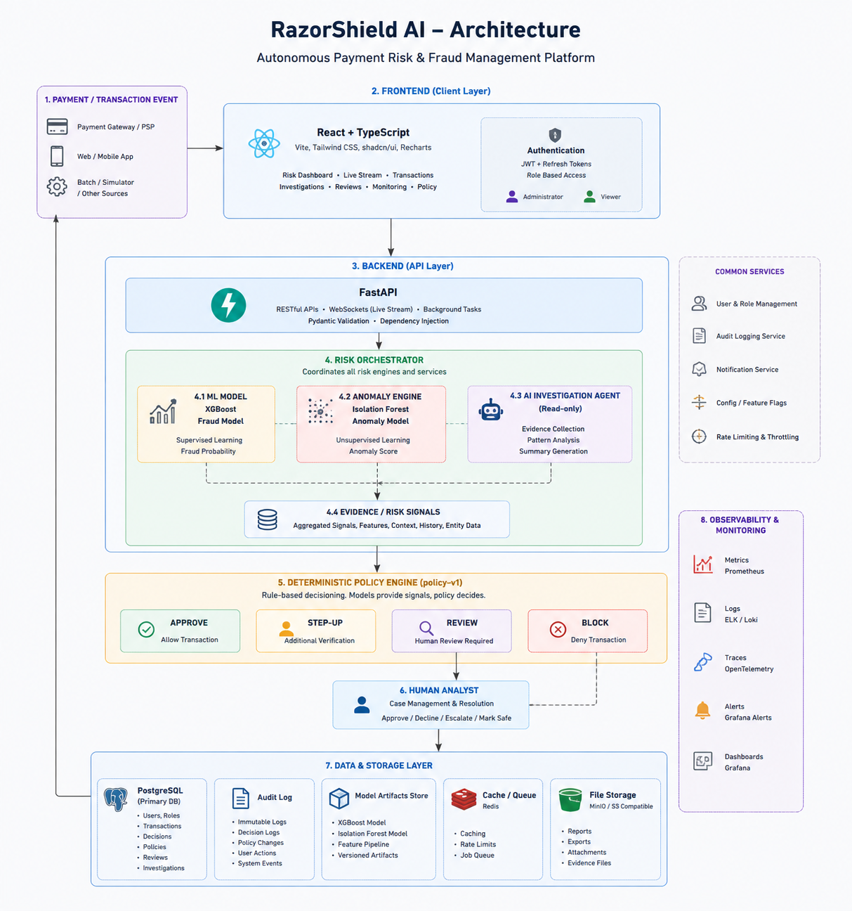

# RazorShield AI

### Autonomous Payment Risk & Fraud Management Platform

RazorShield AI is a real-time payment risk intelligence platform designed to detect suspicious transaction behaviour, evaluate fraud risk, identify behavioural anomalies, and route high-impact decisions through an explainable investigation workflow.

The platform combines deterministic policy rules, fraud-risk scoring, behavioural anomaly detection, investigation workflows, role-based access control, audit logging, and a controlled transaction simulator into a unified risk operations console.

> **Platform Notice**
>
> RazorShield AI is an independent risk-intelligence demonstration platform. It does not represent or connect to Razorpay production infrastructure, production systems, payment gateways, or real customer transaction data. All simulated transactions are clearly identified as `SIMULATED`.

---

## Table of Contents

- [Overview](#overview)
- [Problem Statement](#problem-statement)
- [Solution](#solution)
- [Key Features](#key-features)
- [Core Risk Pipeline](#core-risk-pipeline)
- [System Architecture](#system-architecture)
- [Transaction Processing Workflow](#transaction-processing-workflow)
- [AI Risk & Anomaly Intelligence](#ai-risk--anomaly-intelligence)
- [Decision Engine](#decision-engine)
- [Live Risk Stream](#live-risk-stream)
- [Investigation Workflow](#investigation-workflow)
- [Role-Based Access Control](#role-based-access-control)
- [Audit & Explainability](#audit--explainability)
- [Technology Stack](#technology-stack)
- [Database Architecture](#database-architecture)
- [API Architecture](#api-architecture)
- [Security](#security)
- [Demo Environment](#demo-environment)
- [Dashboard](#dashboard)
- [Project Structure](#project-structure)
- [Getting Started](#getting-started)
- [Running the Application](#running-the-application)
- [Demo Walkthrough](#demo-walkthrough)
- [Testing](#testing)
- [Production Hardening](#production-hardening)
- [Project Phases](#project-phases)
- [Future Roadmap](#future-roadmap)
- [Why RazorShield AI](#why-razorshield-ai)
- [Use Cases](#use-cases)
- [Limitations](#limitations)
- [Conclusion](#conclusion)

---

# Overview

Modern payment systems process large volumes of transactions where only a small percentage may represent fraud, account takeover, coordinated activity, or other abnormal behaviour.

A traditional system that only returns:

```text
Fraud = TRUE
```

is not sufficient for a modern risk operations team.

RazorShield AI is designed around a complete decision lifecycle:

```text
Transaction
    ↓
Risk Evaluation
    ↓
Fraud Probability
    ↓
Behavioural Anomaly Detection
    ↓
Policy Evaluation
    ↓
Risk Classification
    ↓
Decision
    ↓
Investigation / Review
    ↓
Analyst Action
    ↓
Immutable Audit Trail
```

The objective is not only to identify risky payments, but also to answer:

- Why was this transaction considered risky?
- Which signals contributed to the risk?
- Did the model and behavioural engine agree?
- Which policy rule was triggered?
- Should the transaction be approved, stepped-up, reviewed, or blocked?
- Who investigated the case?
- What action was taken?
- Can the complete decision chain be audited later?

---

# Problem Statement

Payment platforms face several challenges when detecting financial risk:

### 1. High transaction volume

Large payment systems continuously process transactions, making manual investigation impossible.

### 2. False positives

Aggressive fraud detection can incorrectly block legitimate customers.

### 3. Behavioural fraud

Some attacks cannot be detected reliably from a single transaction.

Examples include:

- coordinated transactions
- unusual transaction sequences
- abnormal velocity
- behavioural anomalies
- suspicious customer-merchant relationships
- model disagreement

### 4. Lack of explainability

A risk score alone does not explain why a transaction was flagged.

### 5. Operational complexity

Fraud detection is not complete when a transaction receives a score.

The system also needs:

- investigation queues
- review workflows
- analyst actions
- audit trails
- access control
- monitoring
- policy management

---

# Solution

RazorShield AI addresses these challenges through a multi-stage risk operations pipeline.

Instead of relying on a single fraud score, the platform combines:

```text
Transaction Data
      │
      ▼
Fraud Risk Model
      │
      ├──────────────┐
      ▼              ▼
Fraud Probability   Behavioural Anomaly Engine
      │              │
      └──────┬───────┘
             ▼
        Policy Engine
             │
             ▼
      Risk Classification
             │
     ┌───────┼────────┐
     ▼       ▼        ▼
  APPROVE  STEP-UP   REVIEW
                      │
                      ▼
                   BLOCK
             │
             ▼
       Investigation
             │
             ▼
       Audit Logging
```

This creates an end-to-end risk management system rather than a standalone fraud classifier.

---

# Key Features

## Real-Time Risk Stream

The platform provides a live transaction stream where generated payment events pass through the same backend risk pipeline used for transaction evaluation.

The stream exposes:

- transaction ID
- transaction amount
- fraud probability
- anomaly score
- severity
- investigation state
- final decision
- processing progress

---

## Transaction Explorer

Transactions can be explored using:

- search
- decision filters
- risk-level filters
- anomaly severity
- advanced filters
- sorting
- pagination

The transaction explorer provides a database-backed view of the processed transaction dataset.

---

## Fraud Risk Scoring

Each transaction receives a fraud probability from the risk evaluation layer.

Example:

```text
Fraud Probability: 94.09%
```

The probability is used as one of the signals for downstream policy evaluation.

---

## Behavioural Anomaly Detection

The anomaly engine evaluates behavioural signals independently from the fraud probability.

Example:

```text
Anomaly Score: 100 / 100
Severity: CRITICAL
```

This allows the system to identify suspicious behaviour even when the fraud model itself may not assign a high fraud probability.

---

## Explainable Decisions

Every important decision can be traced through:

```text
Transaction
      ↓
Fraud Model
      ↓
Anomaly Engine
      ↓
Investigation
      ↓
Policy Rules
      ↓
Decision
```

The platform exposes reason codes and matched policy rules to improve explainability.

Example reason codes:

```text
Model disagreement
Critical behavioral anomaly
Coordinated activity
```

---

## Human-in-the-Loop Investigation

High-impact transactions can be routed to analysts instead of being automatically blocked.

This creates a safer decision architecture:

```text
Risk detected
     ↓
Policy evaluation
     ↓
Human review required
     ↓
Investigator
     ↓
Analyst decision
     ↓
Audit trail
```

---

## Role-Based Access Control

The platform supports multiple operational roles:

- Admin
- Risk Analyst
- Merchant
- Viewer

Different roles can have different permissions for:

- transaction access
- investigations
- reviews
- simulator controls
- policy management
- audit access

---

## Audit Logging

Important system actions are recorded so that operational decisions can be reviewed later.

The audit layer provides visibility into:

- authentication events
- analyst actions
- policy actions
- investigation updates
- decision changes
- system operations

---

## Controlled Transaction Simulator

The demo environment includes a controlled traffic generator for demonstrating the risk pipeline without using real payment traffic.

Available scenarios can generate different behavioural patterns such as:

- Normal
- Suspicious
- Coordinated fraud
- Ring-like behaviour
- Additional anomaly scenarios

Every generated transaction is prefixed with:

```text
SIM_
```

and is marked:

```text
SIMULATED
```

The simulator generates behaviour only.

It does not directly assign:

- fraud probability
- anomaly score
- investigation result
- final decision

Those are produced by the backend risk pipeline.

---

# Core Risk Pipeline

The complete processing architecture can be represented as:

```text
                    ┌──────────────────────┐
                    │ Transaction Source   │
                    │ / Simulator          │
                    └──────────┬───────────┘
                               │
                               ▼
                    ┌──────────────────────┐
                    │ Transaction Intake   │
                    └──────────┬───────────┘
                               │
                               ▼
                    ┌──────────────────────┐
                    │ Fraud Risk Model     │
                    │                      │
                    │ Fraud Probability    │
                    └──────────┬───────────┘
                               │
                               ▼
                    ┌──────────────────────┐
                    │ Behavioural Anomaly  │
                    │ Engine               │
                    │                      │
                    │ Anomaly Score        │
                    └──────────┬───────────┘
                               │
                               ▼
                    ┌──────────────────────┐
                    │ Investigation Layer  │
                    │                      │
                    │ Evidence + Findings  │
                    └──────────┬───────────┘
                               │
                               ▼
                    ┌──────────────────────┐
                    │ Policy Engine        │
                    │                      │
                    │ Rules + Thresholds   │
                    └──────────┬───────────┘
                               │
                 ┌─────────────┼──────────────┐
                 │             │              │
                 ▼             ▼              ▼
             APPROVE        STEP-UP         REVIEW
                                                │
                                                ▼
                                             BLOCK
                               │
                               ▼
                    ┌──────────────────────┐
                    │ Decision Persistence │
                    └──────────┬───────────┘
                               │
                               ▼
                    ┌──────────────────────┐
                    │ Audit Trail          │
                    └──────────────────────┘
```

---

# 🏗️ System Architecture

RazorShield AI follows a layered architecture that combines real-time transaction processing, dual-model risk intelligence, deterministic policy decisions, human-in-the-loop investigations, and immutable auditability.

<p align="center">
  
</p>
---

# Transaction Processing Workflow

A transaction follows a controlled processing lifecycle.

## Step 1 — Transaction Intake

A transaction enters the platform.

Example:

```text
Transaction ID:
SIM_b57ece52_000010

Amount:
₹20,900.00
```

---

## Step 2 — Fraud Model Evaluation

The transaction is evaluated by the fraud-risk layer.

Example:

```text
Fraud Probability:
1.48%
```

The fraud probability is not the only factor used for the final decision.

---

## Step 3 — Behavioural Analysis

The behavioural engine evaluates suspicious activity patterns.

Example:

```text
Anomaly Score:
100 / 100

Severity:
CRITICAL
```

---

## Step 4 — Investigation

The platform can create an investigation when the combined signals indicate suspicious behaviour.

The investigation can contain:

```text
Findings
Evidence
Reason Codes
Policy Matches
Risk Signals
```

---

## Step 5 — Policy Evaluation

The policy engine evaluates the available signals.

For example:

```text
Fraud Probability
+
Anomaly Score
+
Behavioural Signals
+
Investigation Findings
+
Policy Rules
```

---

## Step 6 — Decision

The transaction is routed to an appropriate outcome.

Possible outcomes:

```text
APPROVE
STEP-UP
REVIEW
BLOCK
```

---

## Step 7 — Persistence

The resulting transaction state is stored in PostgreSQL.

---

## Step 8 — Audit

Important actions are recorded in the audit trail.

This allows the platform to reconstruct the operational history of a transaction.

---

# AI Risk & Anomaly Intelligence

RazorShield AI uses multiple signals instead of relying on a single fraud score.

## Fraud Risk

The fraud model produces a probability value:

```text
0% ─────────────────────────────── 100%
Low                              High
```

Example:

```text
94.09%
```

---

## Behavioural Anomaly

The behavioural engine evaluates abnormal activity independently.

Example:

```text
Anomaly Score: 99
Severity: CRITICAL
```

---

## Model Disagreement

One important risk signal is disagreement between different intelligence layers.

Example:

```text
Fraud Probability: LOW
Anomaly Score: HIGH
```

This can indicate that a transaction appears statistically normal to the fraud model but behaviourally abnormal to another detection layer.

The system can therefore route such cases for additional investigation instead of relying only on the fraud probability.

---

# Decision Engine

The final decision is produced by policy evaluation.

Conceptually:

```text
                    Transaction
                         │
                         ▼
              ┌─────────────────────┐
              │ Risk Signals        │
              ├─────────────────────┤
              │ Fraud Probability   │
              │ Anomaly Score        │
              │ Severity             │
              │ Behaviour            │
              │ Investigation       │
              └──────────┬──────────┘
                         │
                         ▼
                  Policy Evaluation
                         │
            ┌────────────┼────────────┐
            ▼            ▼            ▼
         APPROVE       STEP-UP       REVIEW
                                      │
                                      ▼
                                    BLOCK
```

This separation is intentional:

```text
Model → advises
Policy → decides
Audit → records
```

This makes the system more deterministic and explainable.

---

# Live Risk Stream

The Live Risk Stream provides an operational view of transactions moving through the pipeline.

The interface shows:

```text
Throughput
Processed
High Risk
Queue Depth
Approved
Step-Up
Review
Blocked
```

It also provides a live transaction feed.

Example:

```text
Transaction       SIM_b57ece52_000010
Amount            ₹20,900.00
Fraud Probability 1.48%
Anomaly           100
Severity          CRITICAL
Investigation     HIGH
Decision          REVIEW
```

The stream is backed by the application's controlled transaction-generation and processing pipeline.

It is not connected to live production payment traffic.

---

# Investigation Workflow

A suspicious transaction can move through an investigation workflow.

Example:

```text
┌──────────────┐
│ Transaction  │
└──────┬───────┘
       │
       ▼
┌──────────────┐
│ Fraud Model  │
└──────┬───────┘
       │
       ▼
┌──────────────┐
│ Anomaly      │
│ Detection    │
└──────┬───────┘
       │
       ▼
┌──────────────┐
│ Investigation│
└──────┬───────┘
       │
       ▼
┌──────────────┐
│ Evidence     │
│ & Findings   │
└──────┬───────┘
       │
       ▼
┌──────────────┐
│ Policy       │
│ Decision     │
└──────┬───────┘
       │
       ▼
┌─────────────────────────┐
│ APPROVE / STEP-UP /     │
│ REVIEW / BLOCK          │
└─────────────────────────┘
```

An investigation can expose:

- evidence items
- findings
- matched policy rules
- reason codes
- risk signals
- final decision

---

# Role-Based Access Control

The system uses role-based access control.

## Admin

Administrative users can manage platform-level operations such as:

- user accounts
- passwords
- roles
- system configuration
- simulator controls
- operational administration

---

## Risk Analyst

Risk analysts focus on:

- transaction investigation
- risk review
- suspicious activity
- evidence analysis
- case handling

---

## Merchant

Merchant users can access merchant-relevant operational information based on assigned permissions.

---

## Viewer

Viewer accounts provide read-only access to permitted areas of the console.

---

# Authentication

Authentication is handled by the backend.

The application supports:

```text
Sign In
   ↓
Credential Validation
   ↓
Authenticated Session
   ↓
Role Resolution
   ↓
Permission Enforcement
   ↓
Console Access
```

Passwords are handled through secure password hashing rather than storing plaintext credentials.

---

# Audit & Explainability

Risk systems require more than a final decision.

RazorShield AI maintains an operational trail around important actions and decisions.

The audit layer helps answer:

```text
What happened?
When did it happen?
Which transaction was involved?
Which policy was involved?
Which user performed the action?
What was the resulting state?
```

This improves:

- accountability
- debugging
- compliance readiness
- incident investigation
- operational transparency

---

# Technology Stack

## Frontend

- React
- Modern JavaScript / TypeScript components
- Responsive dashboard UI
- Real-time transaction views
- Risk visualization
- Role-aware navigation

## Backend

- Python
- FastAPI
- SQLAlchemy
- PostgreSQL
- Alembic
- JWT-based authentication

## Infrastructure

- Docker
- Docker Compose
- PostgreSQL container
- Backend container
- Frontend container

## Security

- Password hashing
- JWT authentication
- Role-based access control
- Permission enforcement
- Audit logging
- Controlled simulator permissions

---

# Database Architecture

PostgreSQL is used as the primary persistence layer.

The database stores the operational state required by the risk platform.

Conceptually:

```text
                    PostgreSQL
                        │
        ┌───────────────┼────────────────┐
        │               │                │
        ▼               ▼                ▼
   Transactions     Users/Roles     Investigations
        │               │                │
        │               │                ├── Findings
        │               │                ├── Evidence
        │               │                └── Decisions
        │
        ├── Risk Signals
        ├── Fraud Probability
        ├── Anomaly Score
        ├── Severity
        └── Decision
                        │
                        ▼
                   Audit Events
```

Database migrations are managed through Alembic.

---

# API Architecture

The frontend communicates with the backend through API endpoints.

Conceptual API structure:

```text
Frontend
   │
   ▼
FastAPI
   │
   ├── Authentication
   ├── Users
   ├── Transactions
   ├── Risk Evaluation
   ├── Investigations
   ├── Reviews
   ├── Policies
   ├── Audit Logs
   └── Simulator
```

The backend remains responsible for:

- validation
- business logic
- risk processing
- authorization
- persistence
- decision generation

The browser does not calculate the final risk decision.

---

# Security

Security was treated as a core architectural concern rather than an afterthought.

## Authentication

Users authenticate through the application login flow.

---

## Password Security

Passwords are securely hashed before persistence.

Plaintext passwords are not stored in the database.

---

## JWT Authentication

Authenticated requests can be associated with a signed token containing the required identity and authorization context.

---

## Role-Based Authorization

Access to sensitive operations is controlled by user roles and permissions.

For example:

```text
Viewer
   ↓
Read-only operations

Risk Analyst
   ↓
Investigation / Review

Admin
   ↓
Administrative operations
```

---

## Simulator Permissions

Traffic generation is intentionally protected.

Starting and stopping the traffic generator requires the appropriate simulator control permission.

This prevents unauthorized users from generating large volumes of simulated traffic.

---

# Demo Environment

RazorShield AI contains a controlled transaction simulator for demonstrating the platform.

The simulator allows operators to choose a scenario and configure:

```text
Scenario
Rate / second
Transaction count
```

Example:

```text
Scenario: Coordinated Fraud
Rate: 1 transaction/sec
Count: 10
```

The simulator then generates transactions such as:

```text
SIM_b57ece52_000001
SIM_b57ece52_000002
SIM_b57ece52_000003
...
```

These transactions are processed through the backend pipeline.

### Important

The simulator does not directly determine the final risk outcome.

It only generates controlled transaction behaviour.

The existing risk pipeline evaluates the generated events.

---

# Dashboard

The main dashboard provides a command-center view of the current risk environment.

Example metrics include:

```text
Transactions
Approval Rate
High Risk
Open Reviews
Step-Up
Review
Blocked
Critical Anomalies
```

The dashboard also provides risk trends over time.

---

# Screenshots

Add your final screenshots to the repository and reference them here.

## Risk Command Center

```text

```

## Live Risk Stream

```text

```

## Transaction Explorer

```text

```

## Investigation View

```text

```

## Authentication

```text

```

> Recommended GitHub structure:
>
> `docs/images/`
>
> Store all screenshots and architecture diagrams inside this directory.

---

# Project Structure

```text
RazorShield-AI/
│
├── backend/
│   │
│   ├── app/
│   │   ├── api/
│   │   ├── core/
│   │   ├── models/
│   │   ├── schemas/
│   │   ├── services/
│   │   └── main.py
│   │
│   ├── migrations/
│   │
│   ├── scripts/
│   │   └── manage_users.py
│   │
│   ├── tests/
│   │
│   ├── requirements.txt
│   └── Dockerfile
│
├── frontend/
│   │
│   ├── src/
│   │   ├── components/
│   │   ├── pages/
│   │   ├── services/
│   │   └── ...
│   │
│   ├── package.json
│   └── Dockerfile
│
├── docs/
│   └── images/
│
├── docker-compose.yml
│
├── README.md
│
└── .env.example
```

---

# Getting Started

## Prerequisites

Install:

- Python 3.x
- Node.js
- npm
- Docker Desktop
- Git

Docker Desktop is recommended because the project uses containerized services.

---

# Running the Application

## 1. Clone the Repository

```bash
git clone <YOUR_REPOSITORY_URL>
cd RazorShield-AI
```

---

## 2. Start the Application

```bash
docker compose up -d
```

Check running containers:

```bash
docker compose ps
```

Expected services:

```text
razorshield-postgres
razorshield-backend
razorshield-frontend
```

---

## 3. Access the Application

Frontend:

```text
http://localhost:3000
```

Backend:

```text
http://localhost:8000
```

---

# Local Backend Development

If running the backend outside Docker:

```powershell
cd backend
```

Activate the virtual environment:

```powershell
.\.venv\Scripts\Activate.ps1
```

Verify dependencies:

```powershell
python -c "import jwt; print(jwt.__version__)"
```

Run the backend according to the project's configured development command.

---

# User Management

Administrative user management is provided through:

```text
backend/scripts/manage_users.py
```

Display available commands:

```bash
python scripts/manage_users.py --help
```

List users:

```bash
python scripts/manage_users.py list
```

Create a user:

```bash
python scripts/manage_users.py create
```

Set or replace a password:

```bash
python scripts/manage_users.py set-password --email <EMAIL>
```

Deactivate an account:

```bash
python scripts/manage_users.py deactivate
```

> Always use the project's configured environment variables and database before executing administrative commands.

---

# Demo Walkthrough

The following sequence is recommended for presenting RazorShield AI.

## Step 1 — Sign In

Login using an authorized account.

The console opens according to the user's role and permissions.

---

## Step 2 — Open Dashboard

Navigate to:

```text
Dashboard
```

Show:

- total transactions
- approval rate
- high-risk transactions
- open reviews
- blocked transactions
- critical anomalies
- risk trend

Explain that the dashboard aggregates information persisted by the backend.

---

## Step 3 — Open Live Risk Stream

Navigate to:

```text
Live
```

The Live Risk Stream provides the controlled real-time demonstration environment.

---

## Step 4 — Start Traffic

Select a scenario.

Recommended demonstration:

```text
Scenario:
Coordinated Fraud

Rate:
1 / second

Count:
10
```

Click:

```text
Start
```

The simulator begins generating controlled transactions.

---

## Step 5 — Observe Processing

The generated transactions appear in the live feed.

For example:

```text
SIM_b57ece52_000010
```

The transaction progresses through:

```text
Transaction
      ↓
Fraud Model
      ↓
Anomaly
      ↓
Investigation
      ↓
Decision
```

---

## Step 6 — Show Risk Signals

Open the live investigation.

Demonstrate:

```text
Transaction Amount
Fraud Probability
Anomaly Score
Severity
Investigation Level
Decision
```

Then show:

```text
Findings
Evidence
Policy Rules
Reason Codes
```

---

## Step 7 — Open Transactions

Navigate to:

```text
Transactions
```

Show how the generated transactions are now available in the transaction explorer.

Demonstrate:

- search
- filtering
- sorting
- risk level
- anomaly severity
- decision

---

## Step 8 — Show Investigation

Open a suspicious transaction.

Explain:

```text
The system does not simply say "fraud".

It shows the evidence and signals that contributed
to the operational decision.
```

---

## Step 9 — Show Audit Log

Navigate to:

```text
Audit Log
```

Explain how important actions can be traced back to operational events.

---

# Example Risk Scenario

Consider a transaction:

```text
Transaction:
SIM_b57ece52_000010

Amount:
₹20,900.00

Fraud Probability:
1.48%

Anomaly Score:
100 / 100

Severity:
CRITICAL

Investigation:
HIGH

Decision:
REVIEW
```

At first glance, the fraud probability is relatively low.

However, the behavioural anomaly score is critical.

This demonstrates why a modern risk platform should not rely on only one signal.

The transaction can therefore be routed for investigation instead of blindly approving it.

---

# Testing

The project includes testing around the backend and application behaviour.

Recommended validation areas include:

### Authentication

```text
Valid credentials → Login succeeds
Invalid credentials → Login rejected
Inactive account → Access denied
```

### Authorization

```text
Viewer → Restricted administrative actions denied
Risk Analyst → Investigation access allowed
Admin → Administrative operations allowed
```

### Transaction Processing

```text
Input transaction
       ↓
Risk evaluation
       ↓
Anomaly evaluation
       ↓
Policy evaluation
       ↓
Decision
       ↓
Persistence
```

### Simulator

```text
Start simulator
      ↓
Generate transactions
      ↓
Process transactions
      ↓
Observe live feed
      ↓
Verify persisted records
```

---

# Production Hardening

The current system is designed as a controlled risk-intelligence demonstration platform.

For production deployment, additional infrastructure would be required.

Potential production improvements include:

- managed PostgreSQL
- Redis or distributed queues
- Kafka / event streaming
- horizontal backend scaling
- Kubernetes
- centralized logging
- distributed tracing
- secrets management
- cloud-based object storage
- model monitoring
- feature stores
- rate limiting
- WAF
- service-to-service authentication
- encrypted communication
- automated CI/CD
- disaster recovery
- database replication
- high-availability architecture

---

# Production-Scale Architecture

A future production architecture could look like:

```text
                  Payment Sources
                        │
                        ▼
               ┌─────────────────┐
               │ API Gateway     │
               └────────┬────────┘
                        │
                        ▼
               ┌─────────────────┐
               │ Event Streaming │
               │ Kafka / Queue   │
               └────────┬────────┘
                        │
              ┌─────────┴─────────┐
              │                   │
              ▼                   ▼
       Fraud Risk Service   Behaviour Engine
              │                   │
              └─────────┬─────────┘
                        │
                        ▼
                Policy Engine
                        │
            ┌───────────┼───────────┐
            ▼           ▼           ▼
         APPROVE      STEP-UP      REVIEW
                                    │
                                    ▼
                               Investigation
                                    │
                                    ▼
                                  BLOCK
                                    │
                                    ▼
                             Audit Platform
```

---

# Project Phases

The platform was developed incrementally through multiple phases.

## Phase 1 — Foundation

Established the core application scaffolding:

- FastAPI service
- SQLAlchemy
- Alembic
- React frontend
- Docker packaging
- foundational tests

---

## Phase 2 — Data Foundation

Established the transaction universe and initial dataset required for risk evaluation.

---

## Phase 3 — Risk Intelligence

Implemented risk evaluation and behavioural signals.

---

## Phase 4 — Policy & Decisions

Established deterministic policy evaluation and decision routing.

---

## Phase 5 — Investigation

Introduced:

- investigations
- evidence
- findings
- reason codes
- human review workflows

---

## Phase 6 — Operations Console

Introduced:

- dashboard
- transaction explorer
- live stream
- operational metrics
- risk monitoring

---

## Phase 7 — Simulation

Introduced controlled transaction generation for demonstration and testing.

---

## Phase 8 — Authentication & RBAC

Introduced:

- authentication
- roles
- permissions
- administrative user management

---

## Phase 9 — Auditability

Introduced operational audit logging and traceability.

---

## Phase 10 — Security, Observability & Production Hardening

Focused on:

- security
- permission enforcement
- operational visibility
- containerization
- production-readiness foundations

---

# Future Roadmap

RazorShield AI can evolve into a larger intelligent payment-risk platform.

## 1. Real Payment Gateway Integration

Future integrations could connect the platform to authorized payment providers through secure APIs or event streams.

The current project intentionally does not connect to real payment production traffic.

---

## 2. Streaming Architecture

Replace controlled simulation with production-grade event streaming:

```text
Payment Event
      ↓
Kafka
      ↓
Risk Processing
      ↓
Decision Engine
```

---

## 3. Advanced ML Models

Future versions could incorporate:

- gradient boosting
- deep learning
- graph neural networks
- sequence models
- behavioural embeddings
- online learning

---

## 4. Graph-Based Fraud Detection

A transaction graph could represent:

```text
Customer
   │
   ├── Device
   │
   ├── Payment Method
   │
   ├── Merchant
   │
   └── IP / Location
```

Graph analysis could identify coordinated fraud rings and hidden relationships.

---

## 5. Agentic Risk Investigation

A future AI risk agent could assist analysts by:

```text
Suspicious Transaction
        ↓
Agent retrieves evidence
        ↓
Agent analyzes behaviour
        ↓
Agent checks related entities
        ↓
Agent summarizes findings
        ↓
Agent recommends action
        ↓
Human approves / rejects
```

The human remains in control of high-impact actions.

---

## 6. Automated Experimentation

The system could eventually evaluate policy changes through controlled experiments.

For example:

```text
Policy A
   ↓
Current fraud detection

Policy B
   ↓
New threshold / model

        ↓

Compare:
False Positives
Fraud Capture
Review Volume
Customer Friction
```

---

# Why RazorShield AI

RazorShield AI is designed around a broader concept than simple fraud detection.

The platform connects:

```text
Detection
    +
Explainability
    +
Policy
    +
Investigation
    +
Human Review
    +
Auditability
    +
Security
```

This creates a complete risk-operations workflow.

The important architectural principle is:

> **Models provide intelligence, policies make deterministic decisions, humans handle high-impact cases, and audit logs preserve accountability.**

---

# Use Cases

RazorShield AI can be adapted for:

### Payment Fraud

Detect suspicious payment behaviour and route risky transactions for investigation.

### Account Takeover

Identify abnormal customer behaviour and unusual transaction patterns.

### Coordinated Fraud

Detect related suspicious activities across customers, devices, merchants, or transaction groups.

### Merchant Risk

Monitor merchant-level behavioural anomalies and transaction patterns.

### Financial Crime Operations

Provide investigators with evidence-backed risk signals and operational workflows.

### Security Operations

Create a unified console for monitoring suspicious transactional activity.

---

# Observability

Operational monitoring can be extended around:

```text
API latency
Transaction throughput
Queue depth
Processing failures
Decision distribution
Risk distribution
Investigation volume
Model behaviour
System health
```

The operational dashboard provides a high-level view of platform activity.

---

# Design Principles

## 1. Explainability First

Every important decision should have understandable supporting signals.

## 2. Human-in-the-Loop

High-impact decisions can be routed to analysts.

## 3. Deterministic Policy

Policies provide predictable and reproducible outcomes.

## 4. Separation of Concerns

The architecture separates:

```text
Model
Policy
Investigation
Decision
Audit
```

## 5. Secure by Default

Sensitive operations require appropriate authorization.

## 6. Observable Operations

Risk systems need visibility into both transaction behaviour and system behaviour.

## 7. Controlled Demonstration

The simulator enables realistic risk workflows without requiring real payment traffic.

---

# Important Distinction: Simulator vs Risk Engine

The simulator and risk engine have separate responsibilities.

### Simulator

Generates:

```text
Transaction behaviour
Transaction events
Controlled scenarios
```

### Risk Pipeline

Determines:

```text
Fraud probability
Anomaly score
Severity
Investigation
Policy match
Decision
```

Therefore:

```text
Simulator
    ↓
"Generate behaviour"

Risk Pipeline
    ↓
"Understand behaviour"
```

This separation makes the demonstration architecture closer to a real risk-processing system.

---

# Data Flow Summary

```text
┌──────────────────────┐
│ Transaction Source   │
└──────────┬───────────┘
           │
           ▼
┌──────────────────────┐
│ Transaction Intake   │
└──────────┬───────────┘
           │
           ▼
┌──────────────────────┐
│ Fraud Risk Model     │
└──────────┬───────────┘
           │
           ▼
┌──────────────────────┐
│ Anomaly Detection    │
└──────────┬───────────┘
           │
           ▼
┌──────────────────────┐
│ Investigation Engine │
└──────────┬───────────┘
           │
           ▼
┌──────────────────────┐
│ Policy Engine        │
└──────────┬───────────┘
           │
           ▼
┌──────────────────────┐
│ Decision             │
│                      │
│ APPROVE              │
│ STEP-UP              │
│ REVIEW               │
│ BLOCK                │
└──────────┬───────────┘
           │
           ▼
┌──────────────────────┐
│ PostgreSQL           │
└──────────┬───────────┘
           │
           ▼
┌──────────────────────┐
│ Audit Trail          │
└──────────────────────┘
```

---

# Example Operational Lifecycle

```text
1. Transaction arrives
          ↓
2. Risk model evaluates transaction
          ↓
3. Behaviour engine checks anomaly
          ↓
4. Investigation collects evidence
          ↓
5. Policy engine evaluates risk
          ↓
6. Decision is generated
          ↓
7. High-risk transaction may enter review
          ↓
8. Analyst investigates
          ↓
9. Action is recorded
          ↓
10. Audit trail preserves the operation
```

---

# Project Highlights

### End-to-End Risk Pipeline

Transaction → Model → Anomaly → Investigation → Policy → Decision → Audit

### Real-Time Operational Console

A unified interface for monitoring risk activity.

### Explainable Risk Decisions

Risk outcomes are supported by signals, findings, policy matches, and reason codes.

### Human-in-the-Loop

High-impact cases can be routed to human analysts.

### Controlled Traffic Simulation

Realistic payment-risk scenarios can be demonstrated safely without production traffic.

### Secure Access

Authentication and role-based authorization protect sensitive operations.

### Persistent Data

Transactions and operational state are stored in PostgreSQL.

### Containerized Deployment

The application can be launched using Docker Compose.

---

# Limitations

RazorShield AI is currently a demonstration and engineering platform.

It does not currently represent:

- a production payment gateway
- real Razorpay infrastructure
- real Razorpay transaction traffic
- real customer financial data
- a production banking system
- a fully production-scale fraud detection service

The controlled simulator is intentionally used to demonstrate the complete risk workflow safely.

---

# Disclaimer

> **RazorShield AI is an independent Real-Time Risk Intelligence demonstration platform. It is not affiliated with, operated by, or connected to Razorpay production infrastructure. The platform does not process real Razorpay payment traffic or real customer transaction data. All simulator-generated transactions are synthetic and clearly identified as `SIMULATED`.**

---

# Conclusion

RazorShield AI demonstrates how a modern payment-risk platform can combine machine intelligence, behavioural analysis, deterministic policy, investigation workflows, human review, secure access control, and auditability into a single operational system.

The core architecture is built around a simple principle:

```text
Detect → Understand → Decide → Investigate → Act → Audit
```

Rather than treating fraud detection as a single prediction problem, RazorShield AI approaches it as an end-to-end operational intelligence problem.

The result is a platform designed to make suspicious payment activity:

```text
Visible
Explainable
Actionable
Auditable
```

---

# Built With

```text
Python
FastAPI
SQLAlchemy
Alembic
PostgreSQL
React
Docker
Docker Compose
JWT Authentication
Role-Based Access Control
Risk & Anomaly Intelligence
```

---

# Author

**Kartik Patel**

Computer Science & Engineering

Vellore Institute of Technology

---

## Final Architecture at a Glance

```text
                         RAZORSHIELD AI
                    REAL-TIME RISK INTELLIGENCE
                              │
                              ▼
                    ┌──────────────────┐
                    │ Transaction      │
                    │ Intake           │
                    └────────┬─────────┘
                             │
              ┌──────────────┴──────────────┐
              ▼                             ▼
     ┌─────────────────┐          ┌─────────────────┐
     │ Fraud Risk      │          │ Behavioural     │
     │ Model           │          │ Anomaly Engine  │
     └────────┬────────┘          └────────┬────────┘
              │                            │
              └──────────────┬─────────────┘
                             ▼
                    ┌──────────────────┐
                    │ Investigation    │
                    │ & Evidence       │
                    └────────┬─────────┘
                             │
                             ▼
                    ┌──────────────────┐
                    │ Policy Engine    │
                    └────────┬─────────┘
                             │
             ┌───────────────┼───────────────┐
             ▼               ▼               ▼
         APPROVE          STEP-UP          REVIEW
                                             │
                                             ▼
                                           BLOCK
                                             │
                                             ▼
                                  ┌──────────────────┐
                                  │ PostgreSQL       │
                                  │ Persistence      │
                                  └────────┬─────────┘
                                           │
                                           ▼
                                  ┌──────────────────┐
                                  │ Audit Trail      │
                                  └──────────────────┘
```
